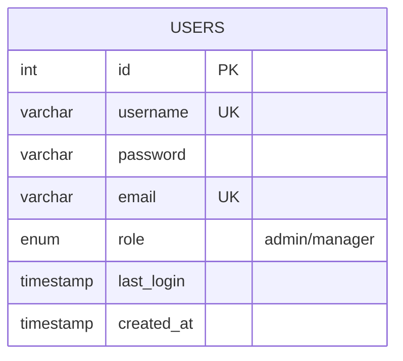
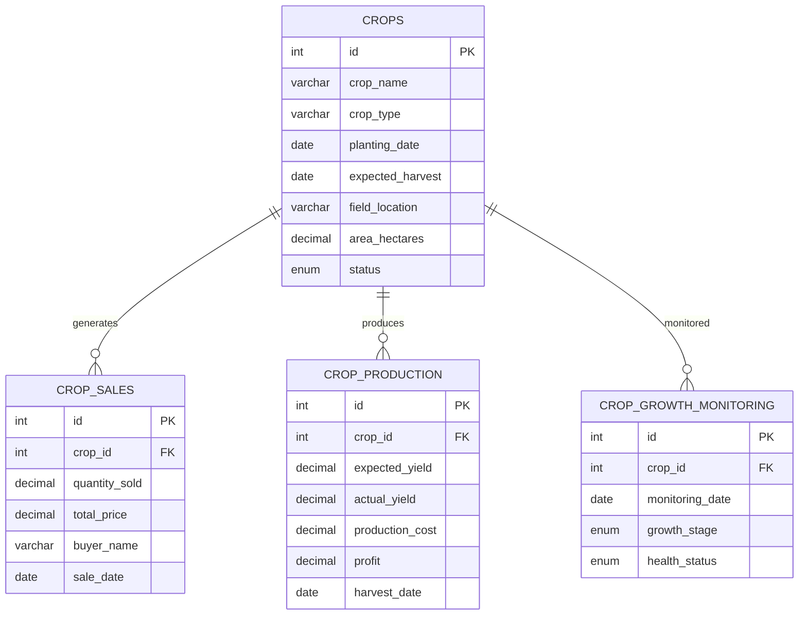
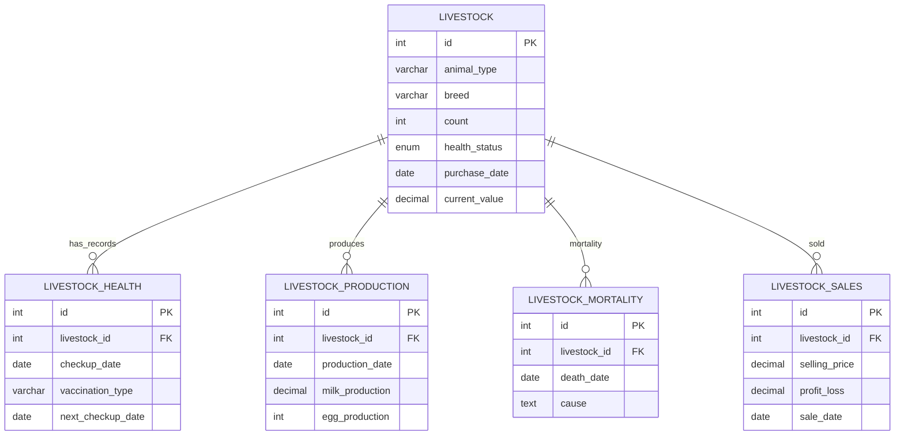
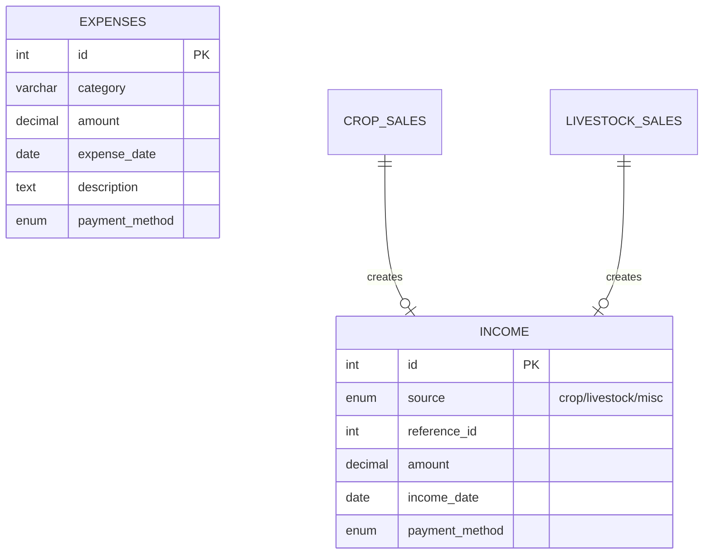
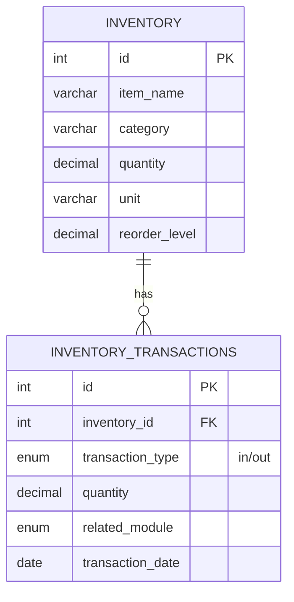
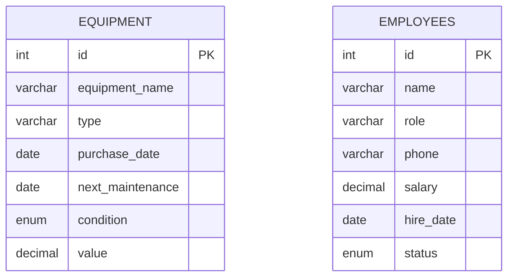

# FarmSaathi Database ER Diagram

## Complete Entity-Relationship Diagram

```mermaid
erDiagram
    %% Core Management Tables
    USERS {
        int id PK
        varchar username UK
        varchar password
        varchar email UK
        enum role
        timestamp last_login
        timestamp created_at
    }

    CROPS {
        int id PK
        varchar crop_name
        varchar crop_type
        date planting_date
        date expected_harvest
        varchar field_location
        decimal area_hectares
        enum status
        text notes
        timestamp created_at
    }

    LIVESTOCK {
        int id PK
        varchar animal_type
        varchar breed
        int count
        int age_months
        enum health_status
        date purchase_date
        decimal current_value
        text notes
        timestamp created_at
    }

    EQUIPMENT {
        int id PK
        varchar equipment_name
        varchar type
        date purchase_date
        date last_maintenance
        date next_maintenance
        enum condition
        decimal value
        text notes
        timestamp created_at
    }

    EMPLOYEES {
        int id PK
        varchar name
        varchar role
        varchar phone
        varchar email
        decimal salary
        date hire_date
        enum status
        text notes
        timestamp created_at
    }

    EXPENSES {
        int id PK
        varchar category
        decimal amount
        date expense_date
        text description
        enum payment_method
        timestamp created_at
    }

    INVENTORY {
        int id PK
        varchar item_name
        varchar category
        decimal quantity
        varchar unit
        decimal reorder_level
        timestamp last_updated
    }

    %% Crop Related Tables
    CROP_SALES {
        int id PK
        int crop_id FK
        varchar crop_name
        decimal quantity_sold
        varchar unit
        decimal rate_per_unit
        decimal total_price
        varchar buyer_name
        varchar buyer_contact
        date sale_date
        timestamp created_at
    }

    CROP_PRODUCTION {
        int id PK
        int crop_id FK
        decimal expected_yield
        decimal actual_yield
        varchar yield_unit
        decimal production_cost
        decimal profit
        date harvest_date
        text notes
        timestamp created_at
        timestamp updated_at
    }

    CROP_GROWTH_MONITORING {
        int id PK
        int crop_id FK
        date monitoring_date
        enum growth_stage
        varchar watering_frequency
        varchar fertilizer_used
        varchar pesticide_used
        text disease_notes
        enum health_status
        timestamp created_at
    }

    %% Livestock Related Tables
    LIVESTOCK_HEALTH {
        int id PK
        int livestock_id FK
        varchar animal_id
        varchar breed
        int age_months
        decimal weight_kg
        date vaccination_date
        varchar vaccination_type
        text disease_history
        text medication_treatment
        date checkup_date
        varchar veterinarian_name
        date next_checkup_date
        timestamp created_at
    }

    LIVESTOCK_PRODUCTION {
        int id PK
        int livestock_id FK
        varchar animal_id
        date production_date
        decimal milk_production
        int egg_production
        decimal meat_production
        decimal feed_consumption
        varchar production_unit
        text notes
        timestamp created_at
    }

    LIVESTOCK_MORTALITY {
        int id PK
        int livestock_id FK
        varchar animal_id
        varchar animal_type
        date death_date
        text cause
        int age_at_death_months
        timestamp created_at
    }

    LIVESTOCK_SALES {
        int id PK
        int livestock_id FK
        varchar animal_type
        varchar breed
        int quantity
        decimal selling_price
        decimal purchase_cost
        decimal profit_loss
        varchar buyer_name
        varchar buyer_contact
        date sale_date
        text notes
        timestamp created_at
    }

    %% Financial Tables
    INCOME {
        int id PK
        enum source
        int reference_id
        decimal amount
        date income_date
        text description
        enum payment_method
        timestamp created_at
    }

    %% Inventory Related Tables
    INVENTORY_TRANSACTIONS {
        int id PK
        int inventory_id FK
        enum transaction_type
        decimal quantity
        varchar purpose
        enum related_module
        date transaction_date
        text notes
        timestamp created_at
    }

    %% Relationships
    CROPS ||--o{ CROP_SALES : "generates"
    CROPS ||--o{ CROP_PRODUCTION : "produces"
    CROPS ||--o{ CROP_GROWTH_MONITORING : "monitored_by"
    
    LIVESTOCK ||--o{ LIVESTOCK_HEALTH : "has_health_records"
    LIVESTOCK ||--o{ LIVESTOCK_PRODUCTION : "produces"
    LIVESTOCK ||--o{ LIVESTOCK_MORTALITY : "may_have_mortality"
    LIVESTOCK ||--o{ LIVESTOCK_SALES : "sold_as"
    
    INVENTORY ||--o{ INVENTORY_TRANSACTIONS : "has_transactions"
    
    CROP_SALES ||--o| INCOME : "creates_income"
    LIVESTOCK_SALES ||--o| INCOME : "creates_income"
```

## Simplified View by Module

### 1. User Management Module

### 2. Crop Management Module

### 3. Livestock Management Module

### 4. Finance Management Module

### 5. Inventory Module

### 6. Equipment & Employee Modules

## Table Statistics

| Module | Tables | Total Fields |
|--------|--------|--------------|
| User Management | 1 | 7 |
| Crop Management | 4 | 45 |
| Livestock Management | 5 | 60 |
| Finance Management | 2 | 14 |
| Inventory | 2 | 15 |
| Equipment | 1 | 10 |
| Employee | 1 | 10 |
| **TOTAL** | **16** | **161** |

## Key Relationships

### One-to-Many Relationships:
1. **CROPS → CROP_SALES** (One crop can have multiple sales)
2. **CROPS → CROP_PRODUCTION** (One crop can have production records)
3. **CROPS → CROP_GROWTH_MONITORING** (One crop monitored multiple times)
4. **LIVESTOCK → LIVESTOCK_HEALTH** (One livestock group has multiple health records)
5. **LIVESTOCK → LIVESTOCK_PRODUCTION** (One livestock group has daily production)
6. **LIVESTOCK → LIVESTOCK_MORTALITY** (One livestock group may have mortality records)
7. **LIVESTOCK → LIVESTOCK_SALES** (One livestock group can be sold multiple times)
8. **INVENTORY → INVENTORY_TRANSACTIONS** (One inventory item has multiple transactions)

### Optional Relationships:
1. **CROP_SALES → INCOME** (Sales may create income records)
2. **LIVESTOCK_SALES → INCOME** (Sales may create income records)
3. **LIVESTOCK_MORTALITY → LIVESTOCK** (Mortality may reference deleted livestock)

## Enumerations (ENUM Types)

### User Roles:
- `admin` - Full system access
- `manager` - Farm operations access

### Crop Status:
- `active` - Currently growing
- `harvested` - Completed harvest
- `failed` - Crop failed

### Livestock Health Status:
- `healthy` - Normal condition
- `sick` - Requires attention
- `under_treatment` - Receiving treatment
- `quarantine` - Isolated

### Equipment Condition:
- `excellent` - Perfect condition
- `good` - Normal wear
- `fair` - Some issues
- `poor` - Needs attention
- `needs_repair` - Requires repair

### Payment Methods:
- `cash` - Cash payment
- `check` - Check payment
- `bank_transfer` - Bank transfer
- `credit_card` - Credit card
- `online` - Online payment

### Growth Stages:
- `seedling` - Early growth
- `vegetative` - Growing phase
- `flowering` - Flowering phase
- `fruiting` - Fruit development
- `harvest` - Ready for harvest

## Indexes

### Performance Optimization Indexes:
- **Users**: username, role
- **Crops**: status, expected_harvest, crop_type
- **Livestock**: animal_type, health_status
- **Equipment**: next_maintenance, condition, type
- **Employees**: status, role
- **Expenses**: category, expense_date
- **Inventory**: category, quantity, reorder_level
- **All Sales Tables**: sale_date
- **All Production Tables**: production_date, crop_id/livestock_id
- **Income**: source, income_date
- **Transactions**: transaction_date, transaction_type

## Foreign Key Constraints

### CASCADE Deletes:
- Crop deletion → Deletes all related sales, production, monitoring
- Livestock deletion → Deletes all related health, production records
- Inventory deletion → Deletes all related transactions

### SET NULL on Delete:
- Livestock deletion → Sets livestock_id to NULL in mortality and sales
- Allows historical records to remain even after parent deletion

## Data Integrity Rules

1. **Unique Constraints**:
   - Username (users)
   - Email (users)

2. **Not Null Constraints**:
   - All primary keys
   - Core identifying fields (names, types, dates)
   - Financial amounts

3. **Default Values**:
   - Timestamps (CURRENT_TIMESTAMP)
   - Status fields (appropriate defaults)
   - Payment methods (cash)

4. **Decimal Precision**:
   - Money fields: DECIMAL(10,2)
   - Quantities: DECIMAL(10,2)
   - Allows up to 99,999,999.99

## Notes

- All tables use InnoDB engine for transaction support
- UTF8MB4 charset for international character support
- Timestamps track record creation
- Indexes optimize common query patterns
- Foreign keys maintain referential integrity
