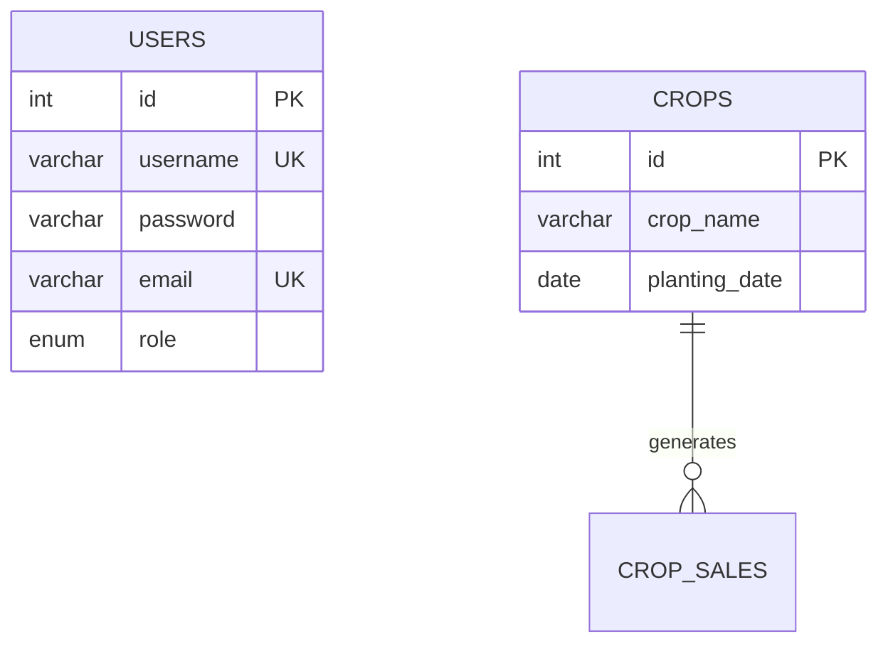

# How to Generate ER Diagram Image

## Method 1: Online Mermaid Editor (Easiest - 2 minutes)

### Steps:
1. Open https://mermaid.live in your browser
2. Open the file `DATABASE_ER_DIAGRAM.md`
3. Copy the entire Mermaid code block (between the ```mermaid and ``` markers)
4. Paste it into the Mermaid Live Editor
5. Click **"Download PNG"** or **"Download SVG"** button
6. Save the image

### Result:
- High-quality diagram image
- Can be used in presentations
- Can be printed

---

## Method 2: VS Code Extension (Best for Development)

### Steps:
1. Install **"Markdown Preview Mermaid Support"** extension in VS Code
2. Open `DATABASE_ER_DIAGRAM.md`
3. Press `Ctrl+Shift+V` (or `Cmd+Shift+V` on Mac) to preview
4. Right-click on the diagram → "Copy Image" or "Save Image"

### Extensions to Install:
- **Markdown Preview Mermaid Support** by Matt Bierner
- **Mermaid Markdown Syntax Highlighting** by Bpruitt-goddard

---

## Method 3: GitHub (Automatic Rendering)

### Steps:
1. Push your code to GitHub
2. Navigate to `DATABASE_ER_DIAGRAM.md` in your repository
3. GitHub automatically renders Mermaid diagrams
4. Take a screenshot or use browser extensions to save

---

## Method 4: Command Line Tool (For Automation)

### Install Mermaid CLI:
```bash
npm install -g @mermaid-js/mermaid-cli
```

### Generate Image:
```bash
mmdc -i DATABASE_ER_DIAGRAM.md -o er-diagram.png
```

### Options:
```bash
# PNG format
mmdc -i DATABASE_ER_DIAGRAM.md -o er-diagram.png -b transparent

# SVG format (scalable)
mmdc -i DATABASE_ER_DIAGRAM.md -o er-diagram.svg

# PDF format
mmdc -i DATABASE_ER_DIAGRAM.md -o er-diagram.pdf
```

---

## Method 5: Online Diagram Tools

### Option A: Draw.io (diagrams.net)
1. Go to https://app.diagrams.net
2. Create new diagram
3. Use the ER diagram shapes
4. Manually recreate based on `DATABASE_STRUCTURE_VISUAL.txt`
5. Export as PNG, SVG, or PDF

### Option B: Lucidchart
1. Go to https://www.lucidchart.com
2. Create new ER diagram
3. Use the template or start from scratch
4. Export as image

### Option C: dbdiagram.io
1. Go to https://dbdiagram.io
2. Use DBML syntax (similar to SQL)
3. Auto-generates ER diagram
4. Export as PNG or PDF

---

## Method 6: MySQL Workbench (From Database)

### Steps:
1. Open MySQL Workbench
2. Connect to your `farm_management` database
3. Go to **Database → Reverse Engineer**
4. Select your database
5. Click **Execute**
6. Go to **File → Export → Export as PNG/SVG/PDF**

### Advantages:
- Shows actual database structure
- Includes all constraints
- Professional looking

---

## Method 7: Screenshot the ASCII Diagram

### Quick Option:
1. Open `DATABASE_STRUCTURE_VISUAL.txt`
2. Use a monospace font (Consolas, Courier New)
3. Zoom to fit
4. Take a screenshot
5. Crop and save

### Tools:
- Windows: Snipping Tool, Snip & Sketch
- Mac: Cmd+Shift+4
- Linux: Screenshot tool

---

## Recommended Approach

### For Quick Preview:
→ **Method 1** (Mermaid Live) - 2 minutes

### For Best Quality:
→ **Method 6** (MySQL Workbench) - Shows actual database

### For Presentations:
→ **Method 1** or **Method 4** - High resolution, professional

### For Documentation:
→ Keep the Markdown file - Renders automatically on GitHub

---

## File Locations

- **Mermaid Diagrams**: `DATABASE_ER_DIAGRAM.md`
- **ASCII Visual**: `DATABASE_STRUCTURE_VISUAL.txt`
- **This Guide**: `HOW_TO_GENERATE_ER_DIAGRAM_IMAGE.md`

---

## Tips for Best Results

1. **Use SVG format** when possible - scales without quality loss
2. **Set background to white** for printing
3. **Use high DPI** (300+) for presentations
4. **Export in multiple formats** - PNG for web, PDF for print
5. **Keep source files** - Easy to update later

---

## Troubleshooting

### Mermaid Live Editor not loading?
- Try a different browser
- Check internet connection
- Clear browser cache

### Diagram too large?
- Split into module-specific diagrams
- Use the simplified views in `DATABASE_ER_DIAGRAM.md`

### Text too small?
- Increase font size in Mermaid config
- Export as SVG and scale up
- Use zoom in image editor

---

## Example: Using Mermaid Live

1. Visit: https://mermaid.live
2. You'll see a code editor on the left
3. Copy this code from `DATABASE_ER_DIAGRAM.md`:



4. Paste in the editor
5. See live preview on the right
6. Click "Actions" → "Download PNG"

Done! You now have your ER diagram as an image.

---

## Need Help?

If you need a specific format or have issues:
1. Check the Mermaid documentation: https://mermaid.js.org
2. Try the MySQL Workbench method for automatic generation
3. Use the ASCII diagram as a reference for manual creation
