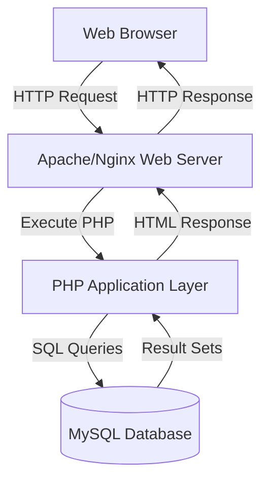
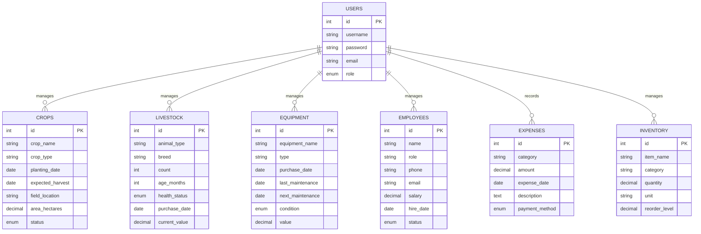

# Farm Management System - Design Document

## Overview

The Farm Management System (FMS) is a traditional server-side rendered web application built with PHP, MySQL, HTML, CSS, and JavaScript. The architecture follows a classic MVC-inspired pattern where PHP handles both business logic and view rendering, with direct database queries for data persistence. The system uses PHP sessions for authentication and state management, with standard HTML forms for all user interactions.

## Architecture

### High-Level Architecture



### Application Structure

```
farm-management-system/
├── config/
│   └── database.php          # Database connection configuration
├── includes/
│   ├── header.php            # Common header with navigation
│   ├── footer.php            # Common footer
│   └── functions.php         # Shared utility functions
├── auth/
│   ├── login.php             # Login page and handler
│   ├── logout.php            # Logout handler
│   ├── register.php          # User registration (admin only)
│   └── session.php           # Session management functions
├── admin/
│   ├── users/
│   │   ├── index.php         # List all users (admin only)
│   │   ├── add.php           # Create user account (admin only)
│   │   ├── edit.php          # Update user account (admin only)
│   │   └── delete.php        # Delete user account (admin only)
│   └── activity/
│       └── index.php         # User activity reports (admin only)
├── dashboard/
│   └── index.php             # Dashboard with statistics
├── crops/
│   ├── index.php             # List crops (manager)
│   ├── add.php               # Add crop form and handler (manager)
│   ├── edit.php              # Edit crop form and handler (manager)
│   └── delete.php            # Delete crop handler (manager)
├── livestock/
│   ├── index.php             # List livestock (manager)
│   ├── add.php               # Add livestock form and handler (manager)
│   ├── edit.php              # Edit livestock form and handler (manager)
│   └── delete.php            # Delete livestock handler (manager)
├── equipment/
│   ├── index.php             # List equipment (manager)
│   ├── add.php               # Add equipment form and handler (manager)
│   ├── edit.php              # Edit equipment form and handler (manager)
│   └── delete.php            # Delete equipment handler (manager)
├── employees/
│   ├── index.php             # List employees (manager)
│   ├── add.php               # Add employee form and handler (manager)
│   ├── edit.php              # Edit employee form and handler (manager)
│   └── delete.php            # Delete employee handler (manager)
├── expenses/
│   ├── index.php             # List expenses (manager)
│   ├── add.php               # Add expense form and handler (manager)
│   ├── edit.php              # Edit expense form and handler (manager)
│   └── delete.php            # Delete expense handler (manager)
├── inventory/
│   ├── index.php             # List inventory (manager)
│   ├── add.php               # Add inventory form and handler (manager)
│   ├── edit.php              # Edit inventory form and handler (manager)
│   └── delete.php            # Delete inventory handler (manager)
├── reports/
│   └── index.php             # Reports generation (manager)
├── assets/
│   ├── css/
│   │   └── style.css         # Main stylesheet
│   └── js/
│       └── main.js           # Client-side JavaScript
└── index.php                 # Entry point (redirects to dashboard or login)
```

## Components and Interfaces

### 1. Database Connection Component

**Purpose:** Establish and manage MySQL database connections

**Implementation:**
- `config/database.php` - Contains database credentials and connection logic
- Uses MySQLi extension for database operations
- Implements connection error handling
- Provides a global connection object for use across the application

**Key Functions:**
```php
function getDBConnection() // Returns MySQLi connection object
function closeDBConnection($conn) // Closes database connection
```

### 2. Authentication Component

**Purpose:** Handle user login, logout, and session management

**Files:**
- `auth/login.php` - Login form and authentication handler
- `auth/logout.php` - Session destruction and logout
- `auth/session.php` - Session validation functions

**Key Functions:**
```php
function authenticateUser($username, $password) // Validates credentials
function createSession($userId, $username, $role) // Creates user session
function isLoggedIn() // Checks if user is authenticated
function requireLogin() // Redirects to login if not authenticated
function hasPermission($requiredRole) // Checks user role permissions
```

**Session Variables:**
- `$_SESSION['user_id']` - User ID
- `$_SESSION['username']` - Username
- `$_SESSION['role']` - User role (admin, manager)
- `$_SESSION['logged_in']` - Boolean flag

### 3. Dashboard Component

**Purpose:** Display key statistics and alerts

**File:** `dashboard/index.php`

**Data Displayed:**
- Total active crops count
- Total livestock count
- Active employees count
- Current month expenses sum
- Alerts for low inventory, upcoming maintenance, approaching harvests

**SQL Queries:**
```sql
-- Count active crops
SELECT COUNT(*) FROM crops WHERE status = 'active'

-- Count livestock
SELECT SUM(count) FROM livestock

-- Count active employees
SELECT COUNT(*) FROM employees WHERE status = 'active'

-- Sum current month expenses
SELECT SUM(amount) FROM expenses 
WHERE MONTH(expense_date) = MONTH(CURRENT_DATE()) 
AND YEAR(expense_date) = YEAR(CURRENT_DATE())

-- Low inventory alerts
SELECT * FROM inventory WHERE quantity <= reorder_level

-- Upcoming maintenance
SELECT * FROM equipment 
WHERE next_maintenance <= DATE_ADD(CURRENT_DATE(), INTERVAL 7 DAY)

-- Approaching harvests
SELECT * FROM crops 
WHERE expected_harvest <= DATE_ADD(CURRENT_DATE(), INTERVAL 14 DAY)
AND status = 'active'
```

### 4. CRUD Module Components

Each module (Crops, Livestock, Equipment, Employees, Expenses, Inventory) follows the same pattern:

**index.php - List View:**
- Displays all records in a table
- Implements search functionality via GET parameter `?search=term`
- Implements filtering via GET parameters
- Implements pagination via GET parameter `?page=n`
- Provides action buttons (Edit, Delete)

**add.php - Create:**
- Displays form for new record
- Handles POST submission
- Validates input data
- Inserts record into database
- Redirects with success/error message

**edit.php - Update:**
- Retrieves record by ID from GET parameter `?id=n`
- Displays pre-filled form
- Handles POST submission
- Validates input data
- Updates record in database
- Redirects with success/error message

**delete.php - Delete:**
- Retrieves record ID from GET parameter `?id=n`
- Displays confirmation (or uses JavaScript confirm)
- Deletes record from database
- Redirects with success/error message

### 5. Validation Component

**Purpose:** Validate and sanitize user inputs

**File:** `includes/functions.php`

**Key Functions:**
```php
function sanitizeInput($data) // Trim, strip tags, escape special chars
function validateRequired($value, $fieldName) // Check required fields
function validateEmail($email) // Validate email format
function validateDate($date) // Validate date format
function validateNumeric($value, $fieldName) // Validate numeric values
function validatePositive($value, $fieldName) // Validate positive numbers
function setFlashMessage($message, $type) // Set session message
function getFlashMessage() // Retrieve and clear session message
```

### 6. Reports Component

**Purpose:** Generate reports with filtered data

**File:** `reports/index.php`

**Report Types:**
- Crops Report: Statistics by crop type, planting schedules
- Livestock Report: Animal counts by type and health status
- Equipment Report: Maintenance schedules and equipment value
- Employee Report: Staff roster and salary information
- Expense Report: Spending by category and time period
- Inventory Report: Stock levels and reorder alerts

**Filtering Options:**
- Date range selection
- Category/type filtering
- Status filtering

### 7. Role-Based Access Control

**Purpose:** Enforce permission boundaries between admin and manager roles

**Implementation:**

**Admin Role Permissions:**
- Create user accounts
- Update user accounts (username, email, role)
- Delete user accounts
- Assign roles to users
- View user activity reports
- View user login history
- Access admin dashboard with user statistics

**Manager Role Permissions:**
- Crop management (create, read, update, delete)
- Livestock management (create, read, update, delete)
- Equipment management (create, read, update, delete)
- Employee management (create, read, update, delete)
- Expense/Finance management (create, read, update, delete)
- Inventory management (create, read, update, delete)
- Generate and view reports
- Access farm operations dashboard

**Permission Checking Functions:**
```php
function requirePermission($requiredRole) {
    // Redirects if user doesn't have required role
    // Admin can access admin-only features
    // Manager can access farm operation features
}

function hasRole($role) {
    // Returns true if user has specified role
    return isset($_SESSION['role']) && $_SESSION['role'] === $role;
}

function isAdmin() {
    return hasRole('admin');
}

function isManager() {
    return hasRole('manager');
}
```

**Navigation Menu Logic:**
- Admin users see: Dashboard, User Management, User Activity
- Manager users see: Dashboard, Crops, Livestock, Equipment, Employees, Expenses, Inventory, Reports
- Both roles see: Profile, Logout

### 8. Frontend Components

**HTML Structure:**
- Semantic HTML5 elements
- Consistent layout with header, navigation, main content, footer
- Forms with proper labels and input types
- Tables with sortable headers
- Modal dialogs for confirmations

**CSS Design:**
- Responsive grid layout using CSS Grid/Flexbox
- Mobile-first approach with media queries
- Breakpoints: 768px (tablet), 1024px (desktop)
- Color scheme: Professional farm-themed palette
- Card-based design for statistics
- Table styling with alternating rows

**JavaScript Functionality:**
- Form validation before submission
- Search filtering (client-side enhancement)
- Modal dialog handling
- Confirmation dialogs for delete operations
- Table sorting (optional enhancement)
- Date picker integration

## Data Models

### Database Schema

```sql
-- Users Table
CREATE TABLE users (
    id INT PRIMARY KEY AUTO_INCREMENT,
    username VARCHAR(50) UNIQUE NOT NULL,
    password VARCHAR(255) NOT NULL,
    email VARCHAR(100) UNIQUE NOT NULL,
    role ENUM('admin', 'manager') DEFAULT 'manager',
    last_login TIMESTAMP NULL,
    created_at TIMESTAMP DEFAULT CURRENT_TIMESTAMP
);

-- Crops Table
CREATE TABLE crops (
    id INT PRIMARY KEY AUTO_INCREMENT,
    crop_name VARCHAR(100) NOT NULL,
    crop_type VARCHAR(50) NOT NULL,
    planting_date DATE NOT NULL,
    expected_harvest DATE NOT NULL,
    field_location VARCHAR(100) NOT NULL,
    area_hectares DECIMAL(10,2) NOT NULL,
    status ENUM('active', 'harvested', 'failed') DEFAULT 'active',
    notes TEXT,
    created_at TIMESTAMP DEFAULT CURRENT_TIMESTAMP
);

-- Livestock Table
CREATE TABLE livestock (
    id INT PRIMARY KEY AUTO_INCREMENT,
    animal_type VARCHAR(50) NOT NULL,
    breed VARCHAR(50) NOT NULL,
    count INT NOT NULL,
    age_months INT NOT NULL,
    health_status ENUM('healthy', 'sick', 'under_treatment', 'quarantine') DEFAULT 'healthy',
    purchase_date DATE NOT NULL,
    current_value DECIMAL(10,2) NOT NULL,
    notes TEXT,
    created_at TIMESTAMP DEFAULT CURRENT_TIMESTAMP
);

-- Equipment Table
CREATE TABLE equipment (
    id INT PRIMARY KEY AUTO_INCREMENT,
    equipment_name VARCHAR(100) NOT NULL,
    type VARCHAR(50) NOT NULL,
    purchase_date DATE NOT NULL,
    last_maintenance DATE,
    next_maintenance DATE,
    condition ENUM('excellent', 'good', 'fair', 'poor', 'needs_repair') DEFAULT 'good',
    value DECIMAL(10,2) NOT NULL,
    notes TEXT,
    created_at TIMESTAMP DEFAULT CURRENT_TIMESTAMP
);

-- Employees Table
CREATE TABLE employees (
    id INT PRIMARY KEY AUTO_INCREMENT,
    name VARCHAR(100) NOT NULL,
    role VARCHAR(50) NOT NULL,
    phone VARCHAR(20) NOT NULL,
    email VARCHAR(100),
    salary DECIMAL(10,2) NOT NULL,
    hire_date DATE NOT NULL,
    status ENUM('active', 'inactive', 'terminated') DEFAULT 'active',
    notes TEXT,
    created_at TIMESTAMP DEFAULT CURRENT_TIMESTAMP
);

-- Expenses Table
CREATE TABLE expenses (
    id INT PRIMARY KEY AUTO_INCREMENT,
    category VARCHAR(50) NOT NULL,
    amount DECIMAL(10,2) NOT NULL,
    expense_date DATE NOT NULL,
    description TEXT NOT NULL,
    payment_method ENUM('cash', 'check', 'bank_transfer', 'credit_card') DEFAULT 'cash',
    created_at TIMESTAMP DEFAULT CURRENT_TIMESTAMP
);

-- Inventory Table
CREATE TABLE inventory (
    id INT PRIMARY KEY AUTO_INCREMENT,
    item_name VARCHAR(100) NOT NULL,
    category VARCHAR(50) NOT NULL,
    quantity DECIMAL(10,2) NOT NULL,
    unit VARCHAR(20) NOT NULL,
    reorder_level DECIMAL(10,2) NOT NULL,
    last_updated TIMESTAMP DEFAULT CURRENT_TIMESTAMP ON UPDATE CURRENT_TIMESTAMP
);
```

### Data Relationships



## Error Handling

### Error Handling Strategy

1. **Database Connection Errors:**
   - Display user-friendly error message
   - Log detailed error to PHP error log
   - Prevent application execution if database unavailable

2. **SQL Query Errors:**
   - Catch MySQLi errors
   - Display generic error message to user
   - Log specific SQL error details
   - Rollback transactions if applicable

3. **Validation Errors:**
   - Collect all validation errors
   - Display errors above form
   - Preserve user input for correction
   - Highlight invalid fields

4. **Authentication Errors:**
   - Display "Invalid credentials" message
   - Implement rate limiting (optional)
   - Log failed login attempts

5. **Authorization Errors:**
   - Display "Access denied" message
   - Redirect to appropriate page
   - Log unauthorized access attempts

### Flash Message System

Use PHP sessions to persist messages across redirects:

```php
// Set message
$_SESSION['flash_message'] = 'Record added successfully';
$_SESSION['flash_type'] = 'success'; // success, error, warning, info

// Display and clear message
if (isset($_SESSION['flash_message'])) {
    echo '<div class="alert alert-' . $_SESSION['flash_type'] . '">';
    echo htmlspecialchars($_SESSION['flash_message']);
    echo '</div>';
    unset($_SESSION['flash_message']);
    unset($_SESSION['flash_type']);
}
```

## Security Considerations

### 1. SQL Injection Prevention
- Use prepared statements with MySQLi
- Sanitize all user inputs
- Validate data types before queries

### 2. XSS Prevention
- Use `htmlspecialchars()` for all output
- Sanitize inputs with `strip_tags()`
- Implement Content Security Policy headers

### 3. CSRF Protection
- Generate and validate CSRF tokens for forms
- Store token in session
- Validate token on form submission

### 4. Password Security
- Use `password_hash()` with PASSWORD_DEFAULT
- Use `password_verify()` for authentication
- Enforce minimum password requirements

### 5. Session Security
- Use `session_regenerate_id()` after login
- Set secure session cookie parameters
- Implement session timeout
- Destroy session on logout

### 6. Input Validation
- Server-side validation for all inputs
- Whitelist validation for enums
- Type checking for numeric values
- Date format validation

## Testing Strategy

### Manual Testing Approach

Since this is a traditional PHP application without a testing framework, testing will be manual:

1. **Functional Testing:**
   - Test each CRUD operation in every module
   - Verify form validation works correctly
   - Test search and filter functionality
   - Verify pagination works correctly
   - Test all navigation links

2. **Authentication Testing:**
   - Test login with valid credentials
   - Test login with invalid credentials
   - Test logout functionality
   - Test session persistence
   - Test unauthorized access attempts

3. **Role-Based Access Testing:**
   - Test admin role permissions (user management, activity reports)
   - Test manager role permissions (farm operations modules)
   - Verify role restrictions work correctly
   - Test that managers cannot access admin functions
   - Test that admins can access user management

4. **Dashboard Testing:**
   - Verify statistics calculations
   - Test alert generation
   - Verify data accuracy

5. **Reports Testing:**
   - Test each report type
   - Verify filtering works correctly
   - Test date range selection
   - Verify data accuracy

6. **Responsive Design Testing:**
   - Test on mobile devices (320px, 375px, 414px)
   - Test on tablets (768px, 1024px)
   - Test on desktop (1280px, 1920px)
   - Verify touch interactions on mobile

7. **Browser Compatibility Testing:**
   - Test on Chrome
   - Test on Firefox
   - Test on Safari
   - Test on Edge

8. **Error Handling Testing:**
   - Test database connection failure
   - Test invalid form submissions
   - Test SQL errors
   - Verify error messages display correctly

### Test Data Setup

Create SQL script to populate database with test data:
- 2 admin users
- 3 manager users
- 20 crop records with various statuses
- 15 livestock records
- 10 equipment records
- 8 employee records
- 30 expense records
- 25 inventory items

## Performance Considerations

1. **Database Optimization:**
   - Add indexes on frequently queried columns (status, dates)
   - Use LIMIT clauses for pagination
   - Optimize JOIN queries if relationships added later

2. **Caching:**
   - Cache dashboard statistics (optional)
   - Use browser caching for static assets

3. **Asset Optimization:**
   - Minify CSS and JavaScript
   - Optimize images
   - Use CDN for external libraries (optional)

4. **Query Optimization:**
   - Avoid SELECT * queries
   - Use specific column selection
   - Implement efficient pagination queries

## Deployment Considerations

1. **Server Requirements:**
   - PHP 7.4 or higher
   - MySQL 5.7 or higher
   - Apache/Nginx web server
   - mod_rewrite enabled (optional for clean URLs)

2. **Configuration:**
   - Set appropriate file permissions
   - Configure PHP error reporting for production
   - Set secure session parameters
   - Configure database connection pooling

3. **Initial Setup:**
   - Run database schema creation script
   - Create initial admin user
   - Set up database credentials in config
   - Configure file upload directories (if needed)

4. **Backup Strategy:**
   - Regular database backups
   - Backup configuration files
   - Version control for code
